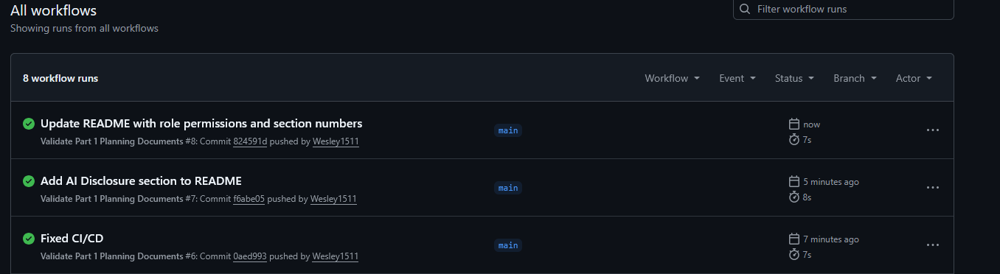

# RaceDay — Wesley Linkmeyer ST10481890

## 1: About the system

RaceDay is a full-stack, web-based event management platform for the South African road running, walking and cycling community. South Africa hosts a huge number of road events such as the Soweto Marathon, the Cape Town Cycle Tour, the Two Oceans, and hundreds of park runs and charity walks every weekend, yet many are still run on paper entry forms, spreadsheets and WhatsApp groups. RaceDay replaces that with a single system.

## 2: User roles

|Role|Permissions|
|-|-|
|Organiser|Create, edit and delete their own events, manage the categories and route waypoints for those events, upload event media. view all enrolments for their events, capture, correct and delete participant results.|
|Participant|Create an account and maintain a racing profile, browse published events; enter an event by selecting a category, view and withdraw from their own entries, view their own results, personal bests and race history.|

## 3: ERD Explanation

|Entity|Purpose|
|-|-|
|Role|Lookup table holding the two system roles.|
|AppUser|Every person who can log in.|
|ParticipantProfile|An Optional 1:1 extension of AppUser holding racing-only details (date of birth, club, shirt size, emergency contact).|
|Event|A single road event, owned by one Organiser.|
|EventCategory|A distance option within an event (42.2 km, 21.1 km, 10 km fun run) with its own fee, start time and capacity.|
|RouteWaypoint|Ordered points along a category's route, start, water points, distance markers, finish. Feeds the route map and the race-day weather lookup.|
|Enrolment|The bridge that resolves the many-to-many relationship between participants and events, through a chosen category.|
|Result|The outcome of one enrolment: finish time, positions and status.|
|EventMedia|information for files stored in Azure Blob Storage in Part 3; only the blob URI is held in SQL.|

Relationships:

|Relationship|Cardinality|
|-|-|
|Role → AppUser|One to many|
|AppUser → ParticipantProfile|One to one (optional)|
|AppUser (Organiser) → Event|One to many|
|Event → EventCategory|One to many|
|EventCategory → RouteWaypoint|One to many|
|AppUser (Participant) ↔ Event|Many to many, resolved by Enrolment|
|Enrolment → Result|One to one (optional until the race is run)|
|Event → EventMedia|One to many|

### Design decisions:

* Enrolment carries both EventId and CategoryId. CategoryId alone would be enough to derive the event, but storing both allows a composite foreign key to EventCategory (EventId, CategoryId). The database itself then guarantees that a participant can never be enrolled in a category belonging to a different event. It also lets UNIQUE (EventId, ParticipantId) stop double entries into the same event.
* Finish times are stored as INT seconds, not TIME. This makes sorting, personal bests and average pace calculations straightforward, and avoids the 24-hour ceiling of TIME (relevant for ultra events such as Comrades).
* Participant-only fields live in a separate table. Putting the emergency contact and shirt size on AppUser would leave those columns permanently NULL for every Organiser row.
* One role per user. A user is either an Organiser or a Participant, matching the brief's two distinct roles. A junction table would allow a person to hold both roles; it was left out deliberately to keep the authorisation logic in Part 2 simple.

## 4: Running the database script

1. Open SQL Server Management Studio and connect to a local SQL Server instance.
2. Open docs/RaceDay-Database.sql.
3. Execute the whole script.
4. The script drops and recreates RaceDayDb, so it is safe to run repeatedly.

## 5: CI/CD

The workflow in .github/workflows/validate-docs.yml runs on every push and pull request and fails the build if any required planning document is missing, if the SQL script does not contain the expected CREATE TABLE and INSERT statements, or if the ERD image is absent.

Screenshot:

## 6: Video walkthrough

Video:

## 7: AI Disclosure

Claude was consulted for the creation of the description fields in the API endpoints document aswell as creating the sample data in the sql script. It was also used to fix a bug in the Validate.yml file that was causing a check to always return with exit code 1

