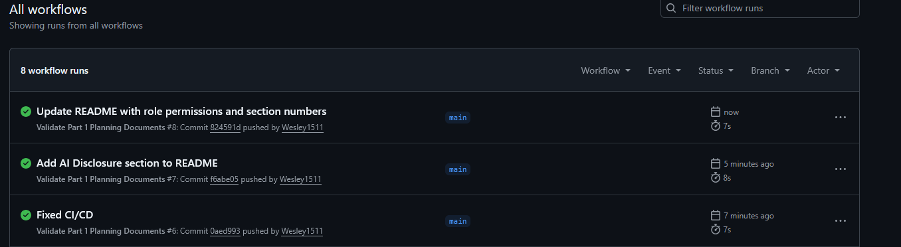

# RaceDay — Wesley Linkmeyer ST10481890
 
## 1: About the system
 
RaceDay is a full-stack, web-based event management platform for the South African road running, walking and cycling community. South Africa hosts a huge number of road events such as the Soweto Marathon, the Cape Town Cycle Tour, the Two Oceans, and hundreds of park runs and charity walks every weekend, yet many are still run on paper entry forms, spreadsheets and WhatsApp groups. RaceDay replaces that with a single system.
 
## 2: User roles
 
**Organiser**
- Create, edit and delete their own events
- Manage the categories and route waypoints for those events
- View all enrolments for their events and confirm or cancel them
- Capture, correct, delete and bulk-upload participant results
**Participant**
- Create an account and maintain a racing profile
- Browse published events and enter an event by selecting a category
- View, change and withdraw from their own entries
- View their own results, personal bests and race history
 
## 3: ERD Explanation
 
The ERD, endpoint plan and SQL script from Part 1 are in the docs folder.
 
### Differences from the Part 1 plan:

* I added POST /api/auth/logout, which is needed to end a session.
* As future proofing for part 3 I added GET /api/results/me also returns the overall position and total finishers, so Part 3 can show results like "47th of 312".
* GET /api/events/{id}/weather also returns an isForecast flag and returns 400 if the event has no coordinates.
* An enrolment is Confirmed when the amount paid covers the entry fee, otherwise it is Pending.

## 4: Running the API
 
1. Install the .NET 8 SDK and SQL Server.
2. Open RaceDay.sln.
3. Run the RaceDay.Api project by pressing F5.
4. Swagger opens at /swagger. On first start the API creates the RaceDayDb database and seeds the sample data.

Sample logins (password: Password123!):
- Organiser: thabo.molefe@comradesrace.co.za
- Participant: sipho.khumalo@gmail.com
 
### Authentication
 
Users register as an Organiser or a Participant. Passwords are hashed with BCrypt and never stored in plain text. On login the API creates a server-side session that stores the user ID and role, and it also returns a JWT. Either one works on protected endpoints. Swagger uses the session automatically, or you can click Authorize and paste the token.
 
## 5: Unit tests
 
The tests are in `RaceDay.Api.Tests` and use xUnit with an in-memory database. They cover registration and login, session use, event management, wrong-role and unauthenticated rejection, enrolments (capacity, minimum age, closed registration, duplicates, withdrawing) and results.
 
Run them with:
 
dotnet test

## 6: CI/CD

Screenshot:

## 7: Video walkthrough
 
Part 1 video: https://www.youtube.com/watch?v=29nPRYdDqjA
 
Part 2 video:
 
## 8: AI Disclosure

Claude was used in order to ensure full testing functionality was reached by pointing out gaps in my test cases, additionally it assisted in determining the nature of bugs that were found.

Claude was also used during the beginning of development to correct an issue with my file structure.
